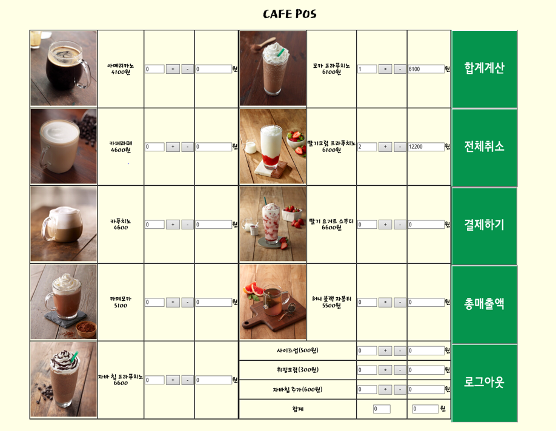
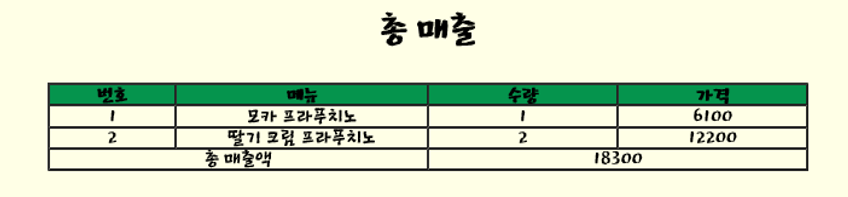

# Cafe-POS
## 기획의도

모든 카페에서 사용하는 pos기 웹 프로그램으로, 다양한 기능을 통해 카페 점주에게 편의성을 제공하고자 한다.

구현된 기능은 합계 계산, 총매출 출력, 결제, 로그인, 로그아웃 기능으로 기본적인 기능을 충실하게 구현하고자 하였다.

## 개발환경

DB : H2

Tool : 이클립스

Back-End : Java, Spring

Front-End : javascript, html, css, jsp, jQuery

## 페이지 설명

메인페이지

총매출액

